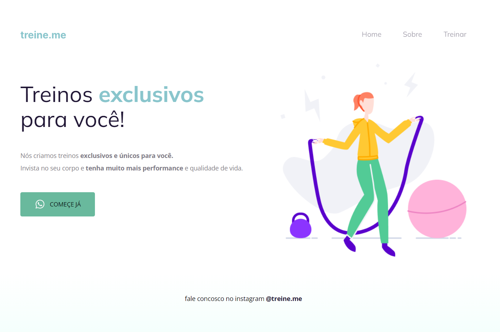

# 💻 Sobre o desafio
Nesse desafio, você receberá um código com o projeto desenvolvido durante as aulas da Fase 02.
E, novamente, a surpresa ~~(não tão surpresa assim)~~ vem aí...  **👀**  
O código sofreu algumas alterações nos principais pontos abordados nessa fase e, como podemos ver na imagem abaixo, ele não está mais da mesma forma que o Maykão deixou.

Topa encarar esse desafio e deixar o site com a mesma carinha de antes? **💜**
Vai ser muito importante para o seu aprendizado rever e aplicar esses novos conceitos. 

## No final o site tem que estar com essa cara aqui:

****Lembrando: tente se desafiar e não olhar a resposta mas, caso apareça alguma dificuldade, você pode voltar nas aulas e rever a maneira com que foi desenvolvido!

Boa sorte e boooooora codar! **🚀**
